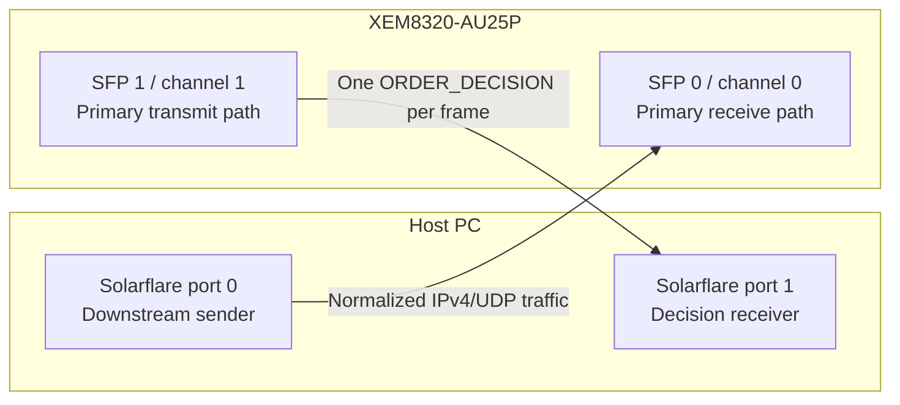
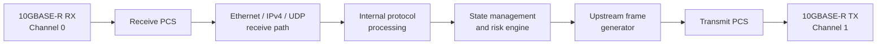
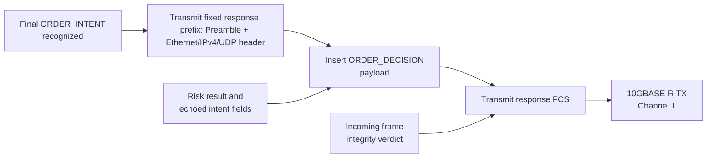

# FPGA Architecture v0

## Purpose

This document describes the FPGA side of the deterministic market-gateway project at a high level. It defines the FPGA's responsibilities, the system topology, and the main architectural ideas that guide the RTL.

## Scope

The FPGA receives host-normalized market and control messages over 10GbE, maintains the state required for pre-trade risk checks, and returns one `ORDER_DECISION` for each `ORDER_INTENT`.

### FPGA responsibilities

- Terminate the two 10GBASE-R links.
- Receive Ethernet II / IPv4 / UDP traffic from the host.
- Extract and decode fixed 32-byte internal messages.
- Maintain session, symbol, top-of-book, and risk-limit state.
- Validate downstream message ordering.
- Evaluate order intents using deterministic risk logic.
- Transmit one accept/reject response per order intent.
- Fail closed when packet integrity or stream state becomes uncertain.

## Physical topology

v0 uses the two SFP+ channels as separate primary paths.



Both physical links remain full duplex, but v0 assigns one primary direction to each:

| Channel | Primary role |
|---|---|
| 0 | Host to FPGA: market state, configuration, and order intents |
| 1 | FPGA to host: order decisions |

## High-level architecture



## Speculative response and FCS stomping



The fixed response prefix may begin transmitting as soon as the final
`ORDER_INTENT` is recognized.

The risk result and echoed intent fields are inserted when the
`ORDER_DECISION` payload reaches the transmit path.

The incoming frame-integrity verdict determines the final response FCS:
- valid incoming frame: transmit the correct FCS;
- invalid incoming frame: transmit a deliberately incorrect FCS.

A response becomes externally valid only when its correct FCS is transmitted.

### Fail-closed recovery

FCS stomping prevents an invalid response from being accepted externally, but it cannot undo speculative state changes already made inside the FPGA.

After a late source-frame failure, v0 therefore:

1. stomps the associated response FCS;
2. latches `recovery_required`;
3. treats trading state as invalid;
4. rejects later order intents with `STREAM_FAULT`; and
5. requires `RESET_ALL` followed by host replay of configuration and market state.

## Risk and response path

The risk engine computes all reject predicates in parallel or in a fixed-latency pipeline. A priority encoder selects one deterministic outcome:

```text
no reject condition  -> ACCEPT / NONE
reject condition -> REJECT / highest-priority reason
```

## Latency measurement
External latency is measured using hardware timestamps from the dual-port Solarflare NIC.

The target metric is:

```text
first response bit reaches the host NIC - last request bit leaves the host NIC
```

The raw measurement will use the NIC's hardware TX and RX timestamp points. The exact timestamp reference point and the clock relationship between the two NIC ports are validated before final latency results are reported.
