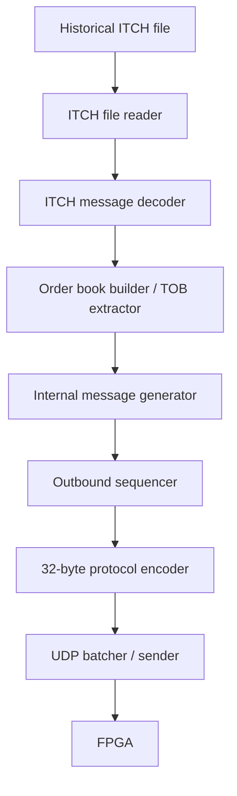

# Host Architecture v0
This document defines the host-side software architecture for the FPGA market-gateway slice.

The host software is responsible for reading historical NASDAQ ITCH data, deriving FPGA-facing event updates, generating internal protocol messages, assigning downstream sequence numbers, and transmitting the encoded 32-byte messages to the FPGA over UDP.

Note: The internal wire format itself is defined separately in `docs/internal_protocol_v0.md`.


## Pipeline Overview



## Responsibilities
### 1. ITCH File Reader

The ITCH file reader reads the decompressed `.NASDAQ_ITCH50` file from disk.

Responsibilities:

- Read the historical ITCH file as a binary stream.
- Read the 2-byte big-endian message length.
- Read exactly that many downstream ITCH payload bytes.
- Expose raw ITCH message payloads to the ITCH message decoder.
- Detect end-of-file cleanly.
- Detect truncated or corrupt file records.

The file-level record format is:
```text
[[message_length][ITCH_message_payload]]
```

where:
message_length: 2-byte big-endian unsigned integer specifying the number of bytes in ITCH_message_payload
ITCH_message_payload: Read exactly that many ITCH payload bytes following the `message length` field.


### 2. ITCH Message Decoder
The ITCH message decoder converts raw ITCH message payloads into typed host-side event objects.

Necessary ITCH message types for v0:
| ITCH type | Meaning |
|---|---|
| `S` | System Event |
| `R` | Stock Directory |
| `H` | Stock Trading Action |
| `A` | Add Order |
| `F` | Add Order with MPID Attribution |
| `E` | Order Executed |
| `C` | Order Executed with Price |
| `X` | Order Cancel |
| `D` | Order Delete |
| `U` | Order Replace |

The decoder should only decode raw ITCH semantics.
Unsupported ITCH message types may be ignored, provided they are not needed for v0 top-of-book generation.

### 3. Symbol Directory

The symbol directory maintains host-side instrument metadata.

Responsibilities:
- Maintain `stock_locate -> ticker` mapping.

Note: In v0, the internal protocol uses `symbol_id = stock_locate` where applicable.

### 4. Order Book Builder / Top-of-Book Extractor

The software book builder maintains enough market state to derive top-of-book for each enabled instrument.

Responsibilities:
- Process ITCH order lifecycle events: `A`, `F`, `E`, `C`, `X`, `D`, and `U`.
- Maintain displayed order state and price-level state as needed.
- Determine whether each ITCH event changes top-of-book.
- Emit a host-side top-of-book update object only when the current best bid/ask changes.

### 5. Internal Protocol Message Generator

The internal protocol message generator converts host-side events into logical internal protocol message objects.

Examples:
| Host-side input | Internal protocol message |
|---|---|
| ITCH `S` System Event | `SESSION_STATUS` |
| ITCH `H` Stock Trading Action | `SYMBOL_STATUS` |
| Top-of-book changed | `TOB_UPDATE` |
| Test/synthetic order | `ORDER_INTENT` |
| Host setup/reset/risk-limit command | `CONFIG_CONTROL` |

This stage creates message objects but does not assign `sequence_number`.

### 6. Outbound Sequencer
The outbound sequencer assigns the global downstream `sequence_number`.

Responsibilities:
- Assign `sequence_number` immediately before a message is committed to the outbound stream.
- Increment `sequence_number` globally across all host-to-FPGA message types.
- Preserve exact downstream message order.

The sequence number should not be assigned when a raw ITCH event is first parsed. Some ITCH events produce no FPGA-facing message, and batching decisions are made later.

### 7. Protocol Encoder

The protocol encoder serializes one logical internal protocol message object into a 32-byte record.

Responsibilities:
- Encode messages according to `docs/internal_protocol_v0.md`.

### 8. UDP Batcher / Sender

The UDP batcher collects encoded 32-byte messages into UDP payloads.

Responsibilities:

- Build UDP payloads containing `N` consecutive 32-byte messages.
- Ensure `1 <= N <= 46` for standard Ethernet MTU 1500 with IPv4/UDP.
- Ensure UDP payload length is always a positive multiple of 32.
- Preserve downstream message order.
- Apply the host flush policy below.
- Send UDP packets to the configured FPGA IP address and UDP port.

The sender should not intentionally transmit UDP packets containing zero internal messages.

## Host Flush Policy

The host may place multiple 32-byte internal protocol messages into one UDP payload. However, batching must not introduce stale market state or reorder the downstream message stream.

The host sender maintains a transmit batch containing zero or more encoded 32-byte messages. A batch is flushed when any flush condition is met.

### Flush Conditions

The host shall flush the current batch when:

1. The batch reaches 46 messages.
2. The oldest message in the batch exceeds `max_tob_batch_delay_ns`.
3. An immediate-flush message is appended to the batch.

Note: The maximum batch size is 46 messages because a standard Ethernet MTU of 1500 bytes gives a maximum IPv4/UDP payload of 1472 bytes, and `1472 / 32 = 46`.

### Immediate-Flush Message Types

The following message types shall trigger immediate flush after being appended to the current batch:

| Message type | Reason |
|---|---|
| `SESSION_STATUS` | Session state affects whether later order intents are valid. |
| `SYMBOL_STATUS` | Symbol trading status affects risk gating. |
| `ORDER_INTENT` | Order-intent latency is part of the core measurement path. |
| `CONFIG_CONTROL` | Configuration and reset commands should take effect deterministically. |

### Ordering Rule

The host shall preserve message order exactly.

If a batch already contains buffered `TOB_UPDATE` messages and an immediate-flush message is generated, the host shall append the immediate-flush message to the same batch and flush the entire batch.

Example:

```text
Buffered:
  seq=100 TOB_UPDATE
  seq=101 TOB_UPDATE

New immediate message:
  seq=102 ORDER_INTENT

Transmit:
  [seq=100][seq=101][seq=102] in one UDP payload
```

The host shall not transmit `seq=102` before `seq=100` and `seq=101`.

## Upstream Decision Receiver

The host should also provide an upstream receiver for FPGA `ORDER_DECISION` messages.

Responsibilities:
- Receive UDP packets from the FPGA.
- Decode one or more 32-byte upstream records.
- Validate `message_type = 0x81`.
- Correlate decisions using `sequence_number` and `intent_id`.
- Log `decision`, `reject_reason`, and `latency_cycles`.
- Detect missing, duplicate, or unexpected decisions during tests.
