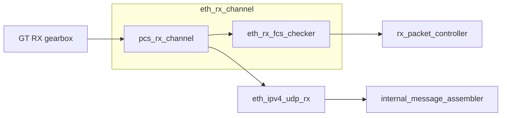
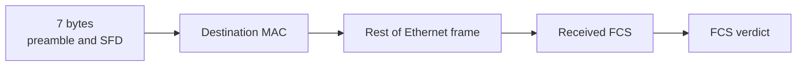

# Ethernet Receive RTL

This folder turns the decoded 10GBASE-R stream into Ethernet frame data,
checks the Ethernet FCS, and extracts the UDP payload.

## Receive path

## Modules

| Module | Purpose |
|---|---|
| `eth_rx_channel` | Connects the PCS receive path to the frame parser and FCS checker. |
| `eth_rx_fcs_checker` | Checks the received Ethernet FCS. |
| `eth_ipv4_udp_rx` | Removes the fixed v0 headers and emits only the UDP payload. |

---

# eth_rx_channel

## Purpose

`eth_rx_channel` wraps the PCS receive path and Ethernet FCS checker for one
receive channel.

It combines:

- `pcs_rx_channel`, which converts 64b/66b blocks into Ethernet frame words;
- `eth_rx_fcs_checker`, which checks the FCS of the same frame stream.

## Connections

| Direction | Module |
|---|---|
| Input from | `gty_10gbase_r_wrapper` |
| Instantiates | `pcs_rx_channel` , `eth_rx_fcs_checker` |
| Frame stream consumed by | `eth_ipv4_udp_rx` |
| FCS result consumed by | `rx_packet_controller` |

## Input format

The GT supplies 64-bit gearbox data and the matching 64b/66b headers.

| Signal | Meaning |
|---|---|
| `rx_data` | Two possible 32-bit gearbox transfers packed into 64 bits. |
| `rx_header` | Matching 64b/66b sync headers. |
| `rx_data_valid` | Indicates which gearbox transfers are valid. |
| `rx_header_valid` | Indicates which sync headers are valid. |
| `rx_start_of_seq` | GT gearbox sequence position. |

## Frame output format

| Signal | Meaning |
|---|---|
| `frame_data` | Up to eight consecutive frame bytes. Earliest byte is in bits `[7:0]`. |
| `frame_keep` | One bit per valid byte lane. |
| `frame_valid` | The frame word is valid. |
| `frame_start` | First frame word after the PCS Start control character. |
| `frame_end` | Final frame word before the PCS Terminate control character. |
| `frame_abort` | The active frame was invalidated. |

The frame stream still contains:

- the remaining preamble and SFD bytes after the Start character;
- the Ethernet header and payload;
- the received FCS.

## Status outputs

| Signal | Meaning |
|---|---|
| `rx_gearbox_slip` | Requests another GT gearbox alignment attempt. |
| `block_lock` | 64b/66b block alignment is locked. |
| `bad_block` | The PCS decoder received an invalid block. |
| `sequence_error` | PCS control blocks appeared in an invalid order. |
| `fcs_result_valid` | A new FCS result is available. |
| `fcs_ok` | The completed frame passed its FCS check. |

## Testbench

`fpga/tb/eth/tb_eth_rx_channel.sv`

Covered cases:

- valid frame through the complete RX channel;
- corrupted frame rejected by FCS;
- frame abort followed by recovery without reset.

---

# eth_rx_fcs_checker

## Purpose

`eth_rx_fcs_checker` checks the CRC-32 value of each completed Ethernet frame.

It observes the frame stream in parallel with `eth_ipv4_udp_rx`. It does not
delay or modify the frame data.

## Connections

| Direction | Module |
|---|---|
| Input from | `pcs_rx_channel`, through `eth_rx_channel` |
| Output to | `rx_packet_controller` and the future response-FCS logic |

## Bytes included in the check

The first seven bytes are skipped.

CRC processing starts at the destination MAC and continues through the received
FCS. A valid frame ends with the standard Ethernet CRC residue.

## Output format

| Output | Meaning |
|---|---|
| `fcs_result_valid` | One-cycle pulse when a completed frame has a verdict. |
| `fcs_ok` | `1` for a good FCS and `0` for a bad FCS. |

`fcs_ok` is meaningful when `fcs_result_valid` is asserted. The value is also
retained until the next frame starts or the current frame aborts.

## Abort behaviour

`frame_abort` clears the running CRC state.

An aborted frame does not produce `fcs_result_valid`, because no complete FCS
verdict exists.

## Testbench

`fpga/tb/eth/tb_eth_rx_fcs_checker.sv`

Covered cases include:

- both legal frame-start alignments;
- different final-byte positions;
- valid gaps between frame words;
- corrupted payload and corrupted FCS;
- frame abort and recovery.

---

# eth_ipv4_udp_rx

## Purpose

`eth_ipv4_udp_rx` removes the fixed v0 Ethernet, IPv4 and UDP headers and emits
only the UDP payload.

It also checks that the UDP length can contain an allowed number of fixed
32-byte internal messages.

## Connections

| Direction | Module |
|---|---|
| Input from | `eth_rx_channel` |
| Output to | `internal_message_assembler` |
| Abort/error output to | Protocol pipeline and error counters |

## Expected frame layout

The PCS Start control character is not present in `frame_data`.

| Frame section | Size | Handling |
|---|---:|---|
| Remaining preamble and SFD | 7 bytes | Removed |
| Ethernet header | 14 bytes | Removed |
| IPv4 header | 20 bytes | Removed |
| UDP header | 8 bytes | Removed |
| UDP payload | 32 to 1472 bytes | Emitted |
| Ethernet FCS | 4 bytes | Not emitted |

The UDP payload begins 49 bytes after the PCS Start character.

## Supported start alignments

| Start type | First-word valid bytes | `frame_keep` |
|---|---:|---:|
| `START_0` | 7 bytes | `0x7F` |
| `START_4` | 3 bytes | `0x07` |

The parser combines bytes from adjacent frame words so that every output payload
word is aligned to 64 bits.

## UDP length rules

The UDP length includes the 8-byte UDP header.

A packet is accepted only when:

- UDP length is at least 40 bytes;
- UDP length is no more than 1480 bytes;
- UDP payload length is a multiple of 32 bytes.

This allows between 1 and 46 internal protocol messages per UDP packet.

## Output format

| Output | Meaning |
|---|---|
| `udp_payload_data` | Eight consecutive UDP payload bytes. Earliest byte is in bits `[7:0]`. |
| `udp_payload_valid` | The payload word is valid. |
| `udp_payload_start` | First payload word of the UDP packet. |
| `udp_payload_end` | Final payload word of the UDP packet. |
| `udp_packet_abort` | Payload output had started, but the packet later became invalid. |
| `parser_error` | The received frame did not match the required format. |

## Error behaviour

Before payload output starts:

- `parser_error` is asserted;
- no payload is emitted;
- no `udp_packet_abort` is needed.

After payload output starts:

- `parser_error` is asserted;
- `udp_packet_abort` is asserted;
- downstream logic must discard the partial packet.

The parser then drains or abandons the remaining frame and can accept the next
frame without reset.

## Current limitations

The current implementation assumes the fixed v0 header layout.

It does not currently compare or validate:

- destination MAC address;
- destination IPv4 address;
- UDP destination port;
- EtherType;
- IPv4 version, header length or protocol;
- IPv4 or UDP checksum.

The `LOCAL_MAC`, `LOCAL_IP` and `LOCAL_UDP_PORT` parameters exist, but are not
yet used by the parser.

Ethernet FCS validation is performed separately by `eth_rx_fcs_checker`.

## Testbench

`fpga/tb/eth/tb_eth_ipv4_udp_rx.sv`

Covered cases include:

- `START_0` and `START_4` alignment;
- one-message and multi-message UDP payloads;
- maximum 1472-byte UDP payload;
- invalid UDP lengths;
- invalid start and final byte masks;
- truncated headers and payloads;
- frame abort before and after payload output begins;
- recovery after malformed frames.
