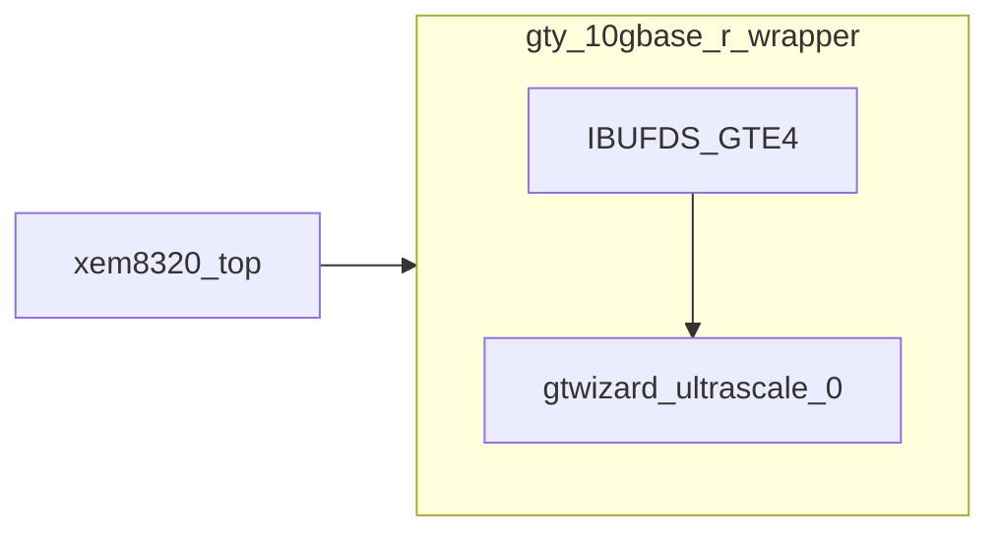
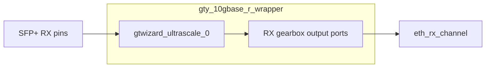

# GT RTL

This folder contains the wrapper around the Xilinx UltraScale GT Wizard used for
the two 10 Gb/s SFP+ channels.

## Hierarchy

`xem8320_top` instantiates `gty_10gbase_r_wrapper`.

`gty_10gbase_r_wrapper` instantiates:

- the differential GT reference-clock buffer;
- the generated Xilinx GT Wizard IP.

---

# gty_10gbase_r_wrapper

## Purpose

`gty_10gbase_r_wrapper` connects the board-level SFP+ pins to the parallel
64b/66b gearbox interfaces used by the custom PCS.

The wrapper handles two GT channels:

| Channel | Board connection |
|---|---|
| Channel 0 | SFP+ cage 1 |
| Channel 1 | SFP+ cage 2 |

## Receive path

For channel 0, `xem8320_top` connects the wrapper's RX gearbox outputs to
`eth_rx_channel`.

Channel 1 is exposed by the wrapper but is not yet connected to an application
receive path.

## Transmit path

The wrapper already exposes the TX gearbox interface, but the project does not
yet contain a TX PCS.

In `xem8320_top`:

- `tx_data`, `tx_header` and `tx_sequence` are tied to zero;
- both SFP+ transmitters are disabled.

## Clocks

| Input or output | Purpose |
|---|---|
| `clk_freerun` | 100 MHz free-running clock used by the GT reset controller. |
| `gt_refclk_p`, `gt_refclk_n` | 156.25 MHz differential GT reference clock. |
| `tx_pcs_clk` | TX user clock generated by the GT Wizard. |
| `rx_pcs_clk` | RX user clock generated by the GT Wizard. |

The differential GT reference clock is converted to a single-ended GT clock by
`IBUFDS_GTE4`.

## Reset handling

| Signal | Meaning |
|---|---|
| `rst` | Requests a complete GT reset. |
| `tx_reset_done` | GT transmit reset sequence has completed. |
| `rx_reset_done` | GT receive reset sequence has completed. |
| `rx_cdr_stable` | Receive clock and data recovery is stable. |
| `gt_power_good` | Per-channel GT power status. |

The wrapper feeds the inverse of `tx_reset_done` and `rx_reset_done` into the
GT Wizard user-clock reset inputs.

`xem8320_top` separately converts `rx_reset_done` into the reset used by the RX
PCS logic.

## Receive gearbox interface

The following outputs are provided for each of the two channels:

| Signal | Meaning |
|---|---|
| `rx_data` | 64-bit scrambled 64b/66b payload from the GT gearbox. |
| `rx_header` | Sync-header output from the GT gearbox. |
| `rx_data_valid` | Indicates valid RX payload output. |
| `rx_header_valid` | Indicates valid RX header output. |

The PCS returns `rx_gearbox_slip` to request a different gearbox alignment.

## Transmit gearbox interface

The wrapper accepts the following inputs for each channel:

| Signal | Meaning |
|---|---|
| `tx_data` | 64-bit scrambled block payload. |
| `tx_header` | 64b/66b sync header. |
| `tx_sequence` | TX gearbox sequence control. |

These inputs will be driven by the future TX PCS.

## Physical interface

| Signal | Meaning |
|---|---|
| `sfp_rx_p`, `sfp_rx_n` | Differential serial receive pairs. |
| `sfp_tx_p`, `sfp_tx_n` | Differential serial transmit pairs. |

## Generated IP

`gtwizard_ultrascale_0` is generated Xilinx IP and is stored separately from
the handwritten wrapper.

The wrapper is the stable boundary between the project RTL and the
tool-generated GT interface.
