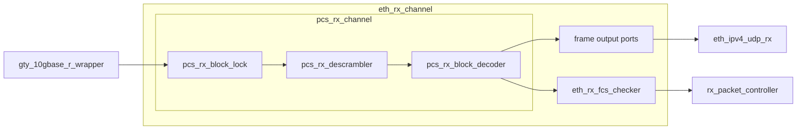
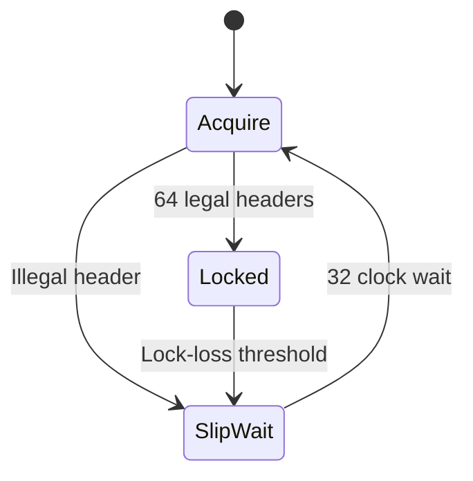

# PCS Receive RTL

This folder converts the GT receive gearbox output into an Ethernet frame-byte
stream.

## Hierarchy and data flow

`eth_rx_channel` instantiates `pcs_rx_channel`. The PCS channel then instantiates
the block-lock, descrambler and block-decoder modules.

## Modules

| Module | Purpose |
|---|---|
| `pcs_rx_channel` | Connects the three PCS receive stages. |
| `pcs_rx_block_lock` | Aligns the GT gearbox to legal 64b/66b block headers. |
| `pcs_rx_descrambler` | Descrambles each aligned 64-bit payload. |
| `pcs_rx_block_decoder` | Converts 64b/66b data and control blocks into Ethernet frame words. |

---

# pcs_rx_channel

## Purpose

`pcs_rx_channel` is the wrapper for the custom 10GBASE-R PCS receive path.

It instantiates, in order:

1. `pcs_rx_block_lock`
2. `pcs_rx_descrambler`
3. `pcs_rx_block_decoder`

## Connections

| Direction | Module |
|---|---|
| Input from | `gty_10gbase_r_wrapper` |
| Instantiates | `pcs_rx_block_lock` |
| Instantiates | `pcs_rx_descrambler` |
| Instantiates | `pcs_rx_block_decoder` |
| Output exposed through | `eth_rx_channel` frame output ports |
| Frame stream consumed by | `eth_ipv4_udp_rx` and `eth_rx_fcs_checker` |

## Input format

| Signal | Meaning |
|---|---|
| `rx_data` | Scrambled 64-bit block payload from the GT gearbox. |
| `rx_header` | 64b/66b sync-header output from the GT. The active header is in bits `[1:0]`. |
| `rx_data_valid` | Indicates valid GT payload output. |
| `rx_header_valid` | Indicates valid GT header output. |
| `rx_start_of_seq` | GT gearbox sequence information. |

## Output format

| Signal | Meaning |
|---|---|
| `rx_gearbox_slip` | Requests a new gearbox alignment. |
| `block_lock` | Valid 64b/66b block alignment has been acquired. |
| `frame_data` | Up to eight Ethernet frame bytes. Earliest byte is in bits `[7:0]`. |
| `frame_keep` | One bit per valid byte lane in `frame_data`. |
| `frame_start` | First frame word after a PCS Start character. |
| `frame_end` | Final frame word before a PCS Terminate character. |
| `frame_valid` | The frame output is valid. |
| `frame_abort` | The active Ethernet frame was invalidated. |
| `bad_block` | The current 64b/66b block is malformed or unsupported. |
| `sequence_error` | Valid block types arrived in an invalid order. |

## Testbench

`fpga/tb/pcs/tb_pcs_rx_channel.sv`

Covered cases:

- complete scrambled frame through all three PCS stages;
- frame abort caused by invalid Start/Terminate sequencing;
- recovery and acceptance of the next frame.

---

# pcs_rx_block_lock

## Purpose

`pcs_rx_block_lock` checks the 64b/66b sync headers from the GT gearbox and
requests gearbox slips until a legal block boundary is found.

Legal sync headers are:

| Header | Meaning |
|---|---|
| `01` | Data block |
| `10` | Control block |

## Connections

| Direction | Module |
|---|---|
| Input from | `gty_10gbase_r_wrapper` |
| Output to | `pcs_rx_descrambler` |
| Slip request to | GT RX gearbox |

## Lock process

The module:

- requires 64 consecutive legal headers to acquire lock;
- ignores GT cycles where payload or header data is not valid;
- requests one gearbox slip when the current alignment is rejected;
- waits 32 RX clocks after each slip;
- monitors header quality while locked;
- loses lock after 16 illegal headers in a 64-block monitoring window.

## Output format

| Signal | Meaning |
|---|---|
| `block_payload` | The original 64-bit scrambled GT payload. |
| `block_header` | The active two-bit sync header. |
| `block_valid` | Payload and header are valid and block lock is active. |
| `block_lock` | The receiver is aligned to 64b/66b boundaries. |
| `rx_gearbox_slip` | One-cycle request to shift the GT gearbox alignment. |

Only locked and valid blocks are forwarded to the descrambler.

## Testbench

`fpga/tb/pcs/tb_pcs_rx_lock_descrambler.sv`

Block-lock coverage includes:

- acquisition after 64 legal headers;
- illegal-header slip request;
- 32-cycle slip wait;
- valid-interface bubbles during acquisition;
- monitoring-window rollover;
- lock loss and reacquisition;
- reset while locked.

---

# pcs_rx_descrambler

## Purpose

`pcs_rx_descrambler` restores the original 64-bit block payload using the
10GBASE-R self-synchronising scrambler polynomial:

`1 + x^39 + x^58`

The two-bit sync header is not scrambled and is passed through unchanged.

## Connections

| Direction | Module |
|---|---|
| Input from | `pcs_rx_block_lock` |
| Output to | `pcs_rx_block_decoder` |

## Synchronisation

The first valid block after lock acquisition is used only to synchronise the
receiver state. It is not emitted.

Each later valid block produces one descrambled payload.

If block lock is lost, the descrambler clears its state and repeats this
synchronisation process after lock is reacquired.

## Input and output format

| Input | Output |
|---|---|
| Scrambled 64-bit payload | Descrambled 64-bit payload |
| Two-bit sync header | Same two-bit sync header |
| `block_valid` | `descrambled_payload_valid` |

## Testbench

`fpga/tb/pcs/tb_pcs_rx_lock_descrambler.sv`

Descrambler coverage includes:

- first-block synchronisation;
- consecutive data and control blocks;
- valid-interface bubbles;
- lock loss and resynchronisation;
- reset and resynchronisation.

---

# pcs_rx_block_decoder

## Purpose

`pcs_rx_block_decoder` interprets descrambled 64b/66b blocks and produces an
Ethernet frame-byte stream.

## Connections

| Direction | Module |
|---|---|
| Input from | `pcs_rx_descrambler` |
| Output to | `eth_rx_channel` |

## Supported block types

| Block | Meaning |
|---|---|
| Data | Eight frame bytes |
| Idle | No frame data |
| Start 0 | Start character in lane 0, followed by seven frame bytes |
| Start 4 | Start character in lane 4, followed by three frame bytes |
| Terminate 0 to 7 | Zero to seven final frame bytes, followed by Terminate |

Other control-block types are rejected in v0.

## Frame output format

| Signal | Meaning |
|---|---|
| `frame_data` | Up to eight frame bytes. Earliest byte is in bits `[7:0]`. |
| `frame_keep` | Marks valid byte lanes in `frame_data`. |
| `frame_start` | Current output begins an Ethernet frame. |
| `frame_end` | Current output ends an Ethernet frame. |
| `frame_valid` | Current frame output is valid. |
| `frame_abort` | A decoder error invalidated the active frame. |

The output frame includes everything after the PCS Start character and before
the PCS Terminate character. This includes the remaining preamble and SFD,
Ethernet headers and payload, and the received FCS.

## Start and end formats

| Event | Valid bytes | `frame_keep` |
|---|---:|---:|
| Start 0 | 7 | `0x7F` |
| Start 4 | 3 | `0x07` |
| Data block | 8 | `0xFF` |
| Terminate 0 | 0 | `0x00` |
| Terminate 1 | 1 | `0x01` |
| Terminate 2 | 2 | `0x03` |
| Terminate 3 | 3 | `0x07` |
| Terminate 4 | 4 | `0x0F` |
| Terminate 5 | 5 | `0x1F` |
| Terminate 6 | 6 | `0x3F` |
| Terminate 7 | 7 | `0x7F` |

## Error outputs

`bad_block` means the current block itself is malformed or unsupported.

Examples:

- unsupported control-block type;
- invalid sync header;
- nonzero reserved control fields;
- malformed Terminate block.

`sequence_error` means a recognised block appeared in the wrong place.

Examples:

- data outside a frame;
- Terminate outside a frame;
- Start while already inside a frame;
- Idle while inside a frame.

An error during an active frame suppresses the offending output, asserts
`frame_abort`, and returns the decoder to the idle frame state.

## Testbench

`fpga/tb/pcs/tb_pcs_rx_block_decoder.sv`

Covered cases:

- complete Start/Data/Terminate frame;
- Start 0 and Start 4;
- all eight Terminate positions;
- data and Terminate outside a frame;
- repeated Start;
- malformed control and Terminate blocks;
- illegal sync header;
- invalid input cycles holding state.
