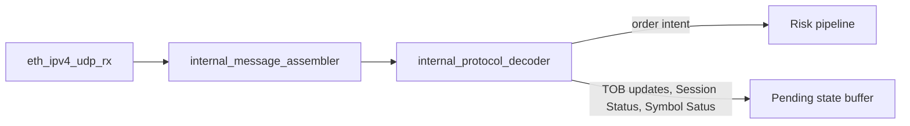
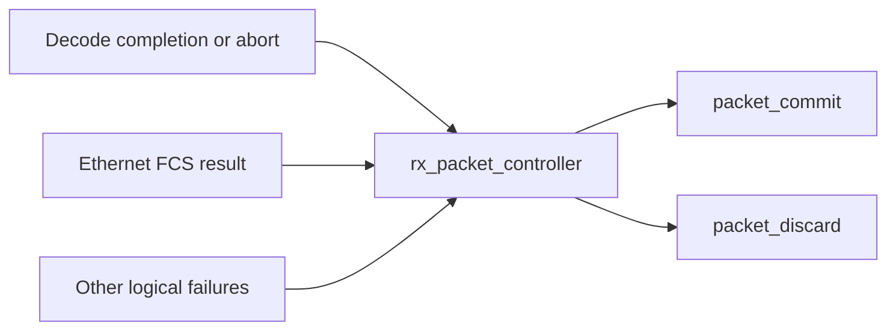
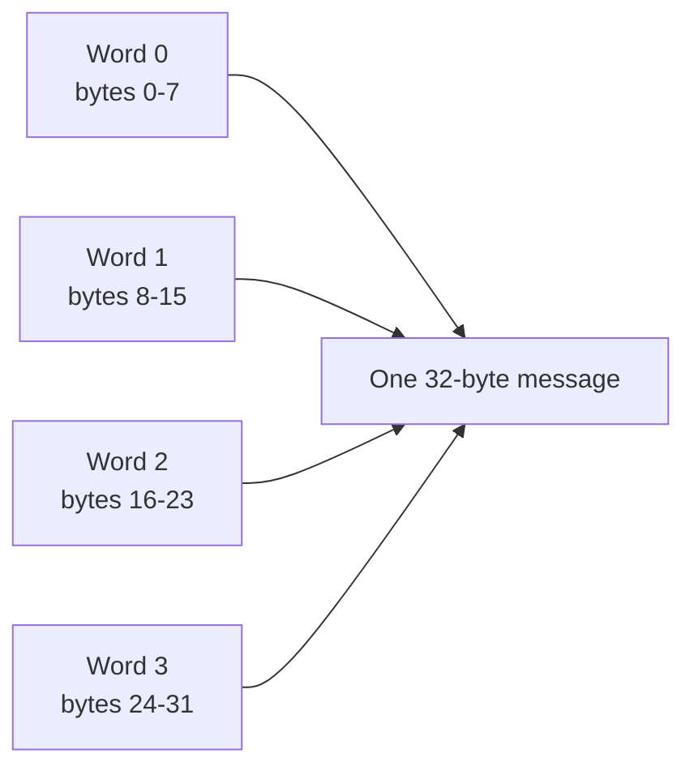
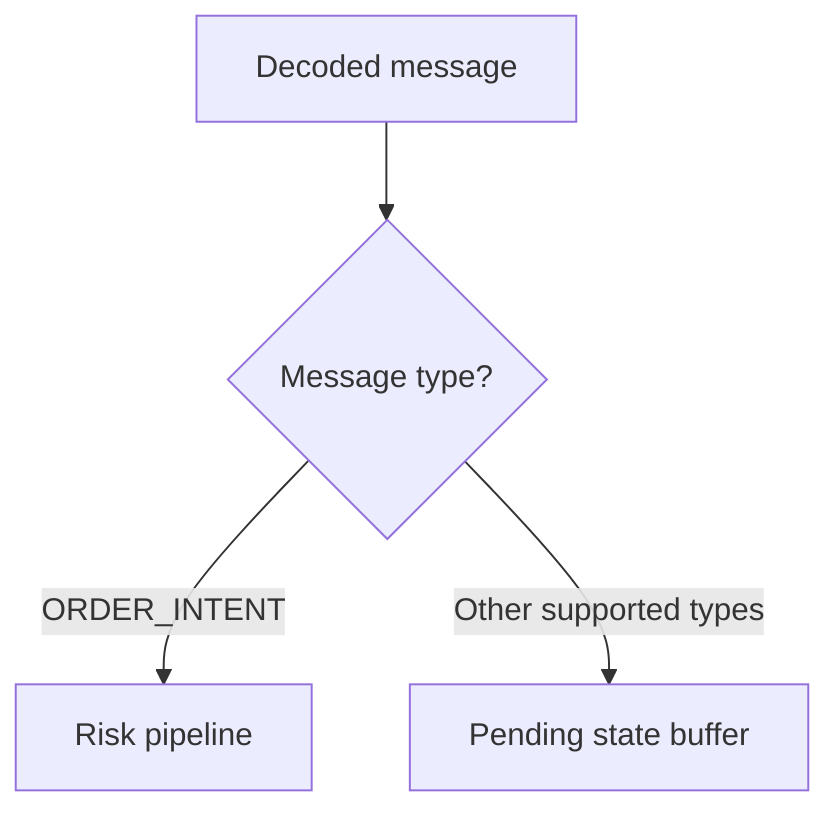
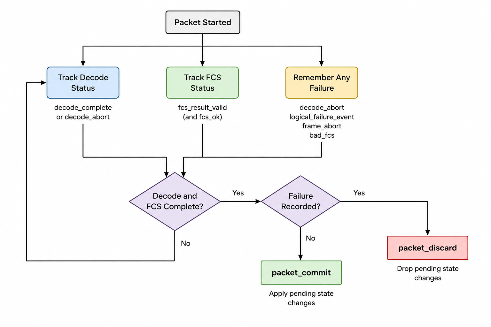
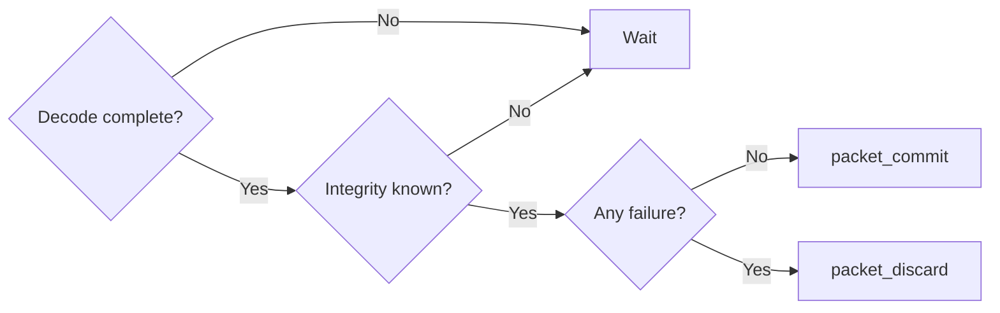
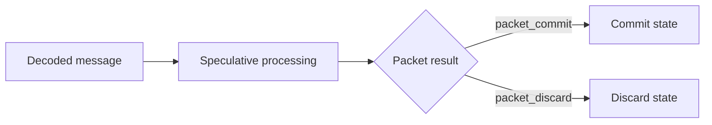

# Protocol RTL

This folder turns UDP payload data into internal protocol messages, validates
those messages, and decides whether the containing packet may update FPGA state.

## Pipeline

Packet validity is resolved separately:

---

# internal_message_assembler

## Purpose

Builds one 32-byte internal protocol message from four 64-bit UDP payload
words.

## Connections

| Direction | Module |
|---|---|
| Input from | `eth_ipv4_udp_rx` |
| Output to | `internal_protocol_decoder` |

## Input format

Each valid input contains eight consecutive UDP payload bytes.

Within each 64-bit word, the earliest byte is in bits `[7:0]`.

| Signal | Meaning |
|---|---|
| `udp_payload_valid` | The current 64-bit word is valid. |
| `udp_payload_start` | First word of the UDP payload. |
| `udp_payload_end` | Final word of the UDP payload. |
| `udp_packet_abort` | Discard the current partial packet. |

## Output format

| Output | Meaning |
|---|---|
| `message_data` | Complete 32-byte message. |
| `message_valid` | Complete message is available. |
| `message_packet_start` | First message in the UDP packet. |
| `message_packet_end` | Final message in the UDP packet. |
| `message_packet_abort` | Packet must be abandoned. |
| `assembler_error` | UDP payload framing was invalid. |

## Errors

The assembler rejects:

- data that does not begin with `udp_payload_start`;
- another start while a packet is active;
- a packet ending halfway through a 32-byte message.

After an error or abort, the next valid packet can be accepted without reset.

## Throughput

- One 64-bit word per clock.
- One complete message every four valid input words.
- Idle cycles may appear between words.

## Testbench

`fpga/tb/protocol/tb_internal_message_assembler.sv`

---

# internal_protocol_decoder

## Purpose

Extracts the fields from each 32-byte message and checks whether the message
follows the internal protocol format.

## Connections

| Direction | Module |
|---|---|
| Input from | `internal_message_assembler` |
| Output to | Future dispatcher, risk pipeline and state buffers |
| Packet status to | `rx_packet_controller` |

## Input message format

| Bytes | Field |
|---:|---|
| 0 | Message type |
| 1 | Flags |
| 2-3 | Reserved |
| 4-7 | Sequence number |
| 8-9 | Symbol ID |
| 10-15 | Timestamp |
| 16-19 | Payload 0 |
| 20-23 | Payload 1 |
| 24-27 | Payload 2 |
| 28-31 | Payload 3 |

Multi-byte values are big-endian.

## Output format

| Output | Meaning |
|---|---|
| `decoded_message_type` | Message type. |
| `decoded_flags` | Message-specific flags. |
| `decoded_sequence_number` | Global downstream sequence number. |
| `decoded_symbol_id` | Instrument identifier. |
| `decoded_timestamp` | Source timestamp. |
| `decoded_payload_0` to `decoded_payload_3` | Message-specific fields. |
| `decoded_valid` | Decoded fields are available. |
| `decoded_packet_start` | First decoded message in the packet. |
| `decoded_packet_end` | Final decoded message in the packet. |
| `decoded_packet_abort` | Packet has a logical protocol failure. |
| `protocol_error` | Current message violates the protocol format. |

The decoded fields are only meaningful when `decoded_valid` is asserted.

## Message interpretation

| Type | Payload 0 | Payload 1 | Payload 2 | Payload 3 |
|---|---|---|---|---|
| `SESSION_STATUS` | Session state | Unused | Unused | Unused |
| `TOB_UPDATE` | Bid price | Bid quantity | Ask price | Ask quantity |
| `SYMBOL_STATUS` | Symbol status | Unused | Unused | Unused |
| `ORDER_INTENT` | Side | Price | Quantity | Intent ID |
| `CONFIG_CONTROL` | Opcode | Value 0 | Value 1 | Config ID |

## Message routing

This routing is combinational and does not add a clock cycle.

## Error handling

A valid message produces `decoded_valid`.

An invalid non-order message produces:

- `protocol_error`;
- `decoded_packet_abort`;
- no valid decoded message.

A malformed `ORDER_INTENT` still provides its fields so the risk path can
return `ORDER_INTENT_PROTOCOL_VIOLATION`.

The decoder does not wait for Ethernet FCS. Processing remains speculative
until the packet controller resolves the packet.

## Throughput

- One complete message may be decoded per clock.
- Decoder output is registered.
- The risk pipeline may begin as soon as an `ORDER_INTENT` appears.

## Testbench

`fpga/tb/protocol/tb_internal_protocol_decoder.sv`

---

# rx_packet_controller

## Purpose

Waits for both logical packet processing and the Ethernet integrity result.
It then produces either `packet_commit` or `packet_discard`.

## Connections

| Direction | Module |
|---|---|
| Packet start from | `eth_ipv4_udp_rx` |
| Decode result from | `internal_protocol_decoder` |
| FCS result from | `eth_rx_channel` |
| Logical failure from | Future sequence tracker and other validators |
| Commit/discard to | Future pending state buffer and sequence tracker |

## Packet resolution

  

## Inputs

| Input | Meaning |
|---|---|
| `packet_start` | New UDP payload transaction started. |
| `decode_complete` | Final message was decoded. |
| `decode_abort` | Decoding ended because the packet failed. |
| `packet_failure_event` | Packet failed, but decoding may continue. |
| `fcs_result_valid` | Ethernet FCS result is available. |
| `fcs_ok` | Ethernet FCS passed. |
| `frame_abort` | Ethernet receive path aborted the frame. |

`packet_failure_event` is intended for failures such as a sequence mismatch.
It marks the packet invalid without ending decoding.

## Outputs

| Output | Meaning |
|---|---|
| `packet_commit` | Pending state changes may become committed. |
| `packet_discard` | Pending state changes must be discarded. |
| `integrity_known` | Incoming frame integrity result is known. |
| `integrity_result_valid` | New integrity result arrived this cycle. |
| `integrity_ok` | Incoming frame passed integrity checking. |
| `integrity_failure` | Frame failed FCS checking or physically aborted. |
| `controller_error` | Events arrived in an invalid order. |

## Commit and discard

`packet_commit` and `packet_discard` are one-cycle pulses.

A packet may be discarded even when its Ethernet FCS is good. A sequence error,
for example, is a logical failure rather than an integrity failure.

## Error handling

`controller_error` is produced for invalid event ordering, including:

- starting another packet while one is pending;
- decode completion without an active packet;
- logical failure without an active packet;
- more than one integrity result for the same packet.

## Testbench

`fpga/tb/protocol/tb_rx_packet_controller.sv`

---

# Speculative processing

The decoder and risk path do not wait for the incoming Ethernet FCS.

An `ORDER_INTENT` may enter the risk pipeline immediately.

Market and configuration updates remain pending until `packet_commit`.
